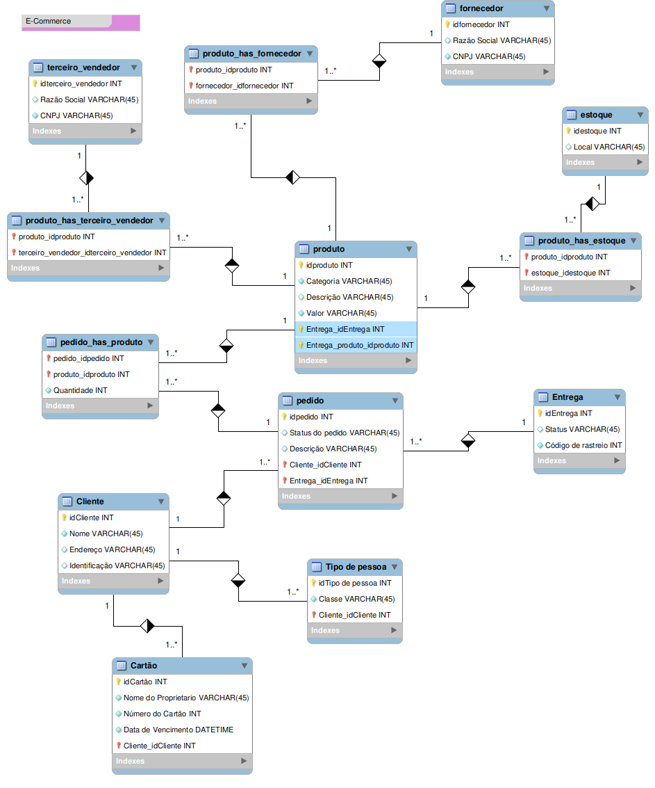

# Modelo de Banco de Dados - E-Commerce

## Descrição
Este documento apresenta o modelo de banco de dados para um sistema de e-commerce, projetado para gerenciar fornecedores, vendedores, produtos, clientes, pedidos e entregas. O modelo foi estruturado para garantir integridade e eficiência no armazenamento e recuperação das informações.

## Diagrama Entidade-Relacionamento

## Principais Entidades

### 1. **Fornecedor**
- Armazena informações sobre os fornecedores de produtos.
- Relacionado com os produtos por meio da tabela `produto_has_fornecedor`.

### 2. **Terceiro Vendedor**
- Representa vendedores terceiros que oferecem produtos na plataforma.
- Relacionado com os produtos por meio da tabela `produto_has_terceiro_vendedor`.

### 3. **Produto**
- Contém informações detalhadas sobre os produtos disponíveis na loja.
- Associado a fornecedores, vendedores e estoques.

### 4. **Cliente**
- Registra os clientes que realizam compras na plataforma.
- Associado a pedidos e informações de pagamento.

### 5. **Pedido**
- Representa as compras realizadas pelos clientes.
- Associado a produtos, clientes e entregas.

### 6. **Entrega**
- Gerencia o status e o código de rastreamento das entregas.

### 7. **Cartão**
- Armazena informações de pagamento dos clientes.

### 8. **Estoque**
- Indica os locais onde os produtos estão armazenados.

## Relacionamentos
- Um fornecedor pode fornecer vários produtos.
- Um terceiro vendedor pode oferecer vários produtos.
- Um cliente pode ter múltiplos pedidos.
- Um pedido pode conter vários produtos.
- Um produto pode estar armazenado em diferentes estoques.
- Cada entrega está associada a um pedido.

## Considerações Finais
Este modelo garante a escalabilidade e a organização dos dados para um sistema de e-commerce, proporcionando um ambiente eficiente para gestão de pedidos, clientes e produtos.

Caso tenha dúvidas ou sugestões de melhorias, fique à vontade para contribuir!

